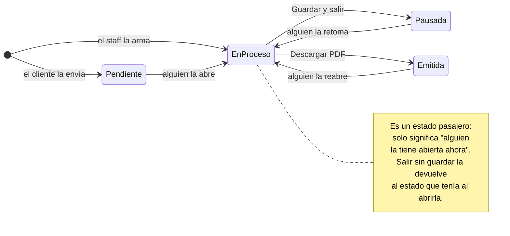
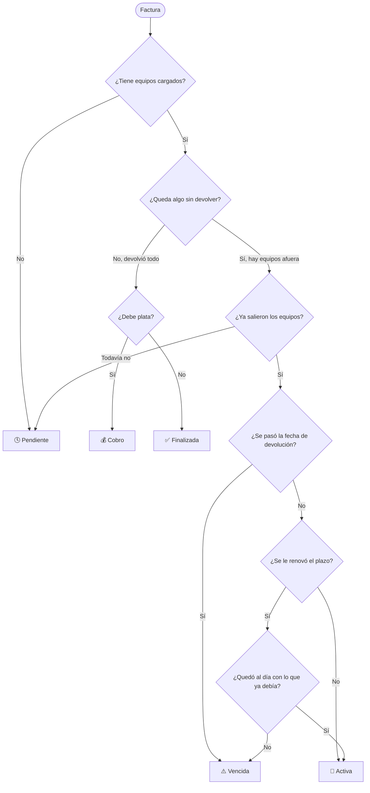
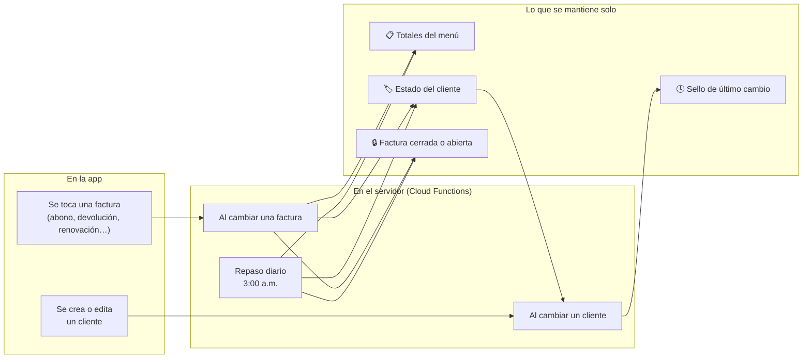

<div align="center">


# Ferrequipos de la Costa

**Catálogo público y sistema de gestión para una empresa de alquiler de equipos de construcción en la costa caribe colombiana.**

Una sola aplicación web que le muestra el catálogo al cliente, recibe sus solicitudes en tiempo real y le da al equipo interno todo lo que necesita para cotizar, facturar, cobrar y hacerle seguimiento a la cartera.

<br>


</div>

---

## El problema que resuelve

Un negocio de alquiler no vende: **presta y recupera**. Cada equipo que sale tiene que volver, y cada día que no vuelve se cobra. Eso obliga a saber, en todo momento y sin buscar en papeles:

- Qué equipos están afuera y desde cuándo.
- A quién se le venció el plazo y hay que llamar hoy.
- Cuánta plata falta por cobrar.
- Qué se hizo la última vez que se llamó a ese cliente.

Esta aplicación sostiene ese ciclo completo: **el cliente pide → se cotiza → se factura → se despacha → se hace seguimiento → se cobra → se cierra.**

---

## Dos aplicaciones en una

| | **Tienda y Kiosco** | **Panel interno** |
|---|---|---|
| **Para quién** | Clientes, desde su celular o desde una pantalla en el local | El equipo de Ferrequipos |
| **Qué hace** | Explorar el catálogo, armar un carrito y enviar la solicitud | Cotizar, facturar, cobrar y seguir la cartera |
| **Cómo entra** | Sin cuenta, abierto a todos | Con usuario y contraseña, con permisos por rol |
| **Detalle** | El modo Kiosco fuerza tema oscuro y tiene protector de pantalla por inactividad | Aviso sonoro cuando entra una solicitud nueva |

Cuando un cliente envía su solicitud, esta **aparece sola en el buzón del personal**, sin recargar la página, y suena una campana.

---

## Módulos del panel

| Módulo | Para qué sirve |
|---|---|
| **Solicitudes** | Buzón en vivo de lo que piden los clientes desde la tienda |
| **Cotización** | Arma la cotización, calcula totales y genera el PDF |
| **Cuenta de cobro** | Emite el documento de cobro con numeración propia (`CC-…`) |
| **Clientes** | Ficha de cada cliente, con todas sus facturas y su estado de cuenta |
| **Cartera / Seguimiento** | Los clientes que deben o se les venció el plazo, con su bitácora de gestiones |
| **Equipos** | Alta, edición y eliminación del catálogo, con fotos |
| **Usuarios** | Cuentas del personal, con roles y permisos |

### Roles

| Rol | Alcance |
|---|---|
| `gestorEditor` | Solo el catálogo de equipos |
| `gestorFacturacion` | Cotizaciones, cuentas de cobro, clientes y cartera |
| `gestorIntegral` | Todo lo anterior junto |
| `administrador` | Todo, más la gestión de usuarios |

---

## Cómo funciona por dentro

Esta es la parte que le da valor al proyecto: **casi ningún estado se elige a mano desde un menú.** Los estados se deducen de los datos o los mantiene el servidor. Un dato que alguien tiene que acordarse de actualizar es un dato que tarde o temprano miente.

### 1. La cotización

Nace de dos formas: la envía un cliente desde la tienda (queda **Pendiente**) o la arma el personal desde el menú.



| Venía de | ¿Hubo cambios? | Al salir | Queda |
|---|---|---|---|
| Cualquiera | Cualquiera | Descargar PDF | **Emitida** |
| Pendiente / Pausada / Emitida | No | Sale directo | Igual que antes |
| Pendiente | Sí | Descartar / Guardar | Pendiente / **Pausada** |
| Pausada | Sí | Descartar / Guardar | Pausada / **Pausada** |
| Emitida | Sí | Descartar / Guardar | Emitida / **Pausada** |
| Nueva | No | Sale directo | No se guarda nada |

> [!NOTE]
> **Por qué importa el estado pasajero:** sin él, una cotización que alguien abrió y dejó a medias quedaba marcada como "la tiene fulano" para siempre, y nadie más se atrevía a tocarla. Ahora ninguna salida la deja colgada.

**Regla de las 3 p.m.** — Al armar una factura, el alquiler arranca el mismo día si se carga antes de las 3:00 p.m. (hora de Colombia); desde esa hora, arranca al día siguiente. La app propone la fecha correcta sola.

### 2. La cuenta de cobro

Usa **exactamente los mismos estados** que la cotización: se abre, se pausa y se emite igual. Se numera sola (`CC-…`) y cobra el **saldo pendiente** de la factura, no el total.

### 3. La factura: su estado se calcula, nunca se guarda

Este es el corazón del sistema. El estado de una factura **no existe como campo** en la base de datos: se deduce cada vez que se mira, a partir de sus fechas, sus cantidades devueltas y su saldo.



| Estado | Qué significa |
|---|---|
| 🕓 **Pendiente** | Ya se facturó, pero todavía no llega la fecha de despacho |
| 🚜 **Activa** | Los equipos están afuera y el alquiler está vigente |
| ⚠️ **Vencida** | Se pasó la fecha y hay equipos sin devolver |
| 💰 **Cobro** | Volvieron todos los equipos, pero queda plata sin resolver |
| ✅ **Finalizada** | No queda nada pendiente, en ninguna de las dos direcciones |

> [!NOTE]
> **"Cobro" no siempre significa que el cliente deba.** También entra ahí cuando **la empresa le debe al cliente**: un depósito por devolver o un pago de más. Una factura solo llega a *Finalizada* cuando no queda ningún asunto de plata abierto — si no, una factura "terminada" podría estar tapando una deuda con el cliente.

> [!IMPORTANT]
> **La regla menos obvia — qué saldo cuenta en cada decisión.**
> Para saber si una factura pasa a *Cobro* o *Finalizada* se usa el saldo completo: es la cuenta final, no queda nada por cobrar después.
> Para saber si una renovación la devuelve a *Activa* se usa el saldo **anterior a esa renovación**. Los días recién agregados no cuentan todavía: se cobran cuando el cliente devuelva, igual que cualquier día de alquiler en curso. Si contaran, renovar nunca alcanzaría por sí solo para poner una factura al día.

**Ejemplo real:** una rana alquilada 4 días y pagada completa se vence → el cliente pide 3 días más → como no debía nada, vuelve a *Activa* → y vuelve sola a *Vencida* el día que se cumplen esos 3 días. Nadie tocó un menú.

### El equipo que no vuelve se sigue cobrando

Un equipo que pasó su fecha y sigue en la obra **suma un día de alquiler por cada día que pasa**, automáticamente. Da lo mismo si el cliente avisó que la entrega quedaba indefinida o si simplemente no devolvió y no contesta: en los dos casos tiene el equipo, y en los dos se cobra.

Esos días se cuentan **hasta el día de la devolución**. Cuando el equipo vuelve, quedan congelados en la cuenta: ni siguen creciendo, ni desaparecen.

En la ficha del cliente se ven en dos etiquetas separadas, porque son cosas distintas: los **días pactados** al ampliar el plazo, y los **días vencidos** que el cliente se tomó sin avisar.

> [!WARNING]
> **Este fue un error costoso.** Antes solo se cobraban los días de los equipos marcados como "entrega indefinida". Al que simplemente no devolvía no se le cobraba ni un día: la pantalla de cartera mostraba *"6 días · $1.200.000"* como aviso, pero esa plata no entraba en ninguna cuenta. Y a los indefinidos se les cobraba… hasta que devolvían, porque los días se calculaban al vuelo desde esa marca y al registrar la devolución se borraban de la cuenta. Dos clientes en la misma situación real se cobraban distinto según cómo se hubiera cargado una fecha.

### 4. Las gestiones: la bitácora del cobro

El estado dice en qué punto está la factura. **La gestión dice qué se hizo para destrabarla.** Solo se ve en Seguimiento, y solo entran ahí las facturas *Vencidas* y en *Cobro*.

| Gestión | Qué pasó |
|---|---|
| ⚪ **Sin gestionar** | Acaba de entrar a la lista, nadie la ha trabajado |
| 📵 **Sin respuesta** | Se llamó al cliente y no contestó |
| 🔄 **Renovación** | Se le autorizaron más días |
| 📦 **Parcial** | Devolvió una parte de los equipos |
| 💰 **Cobro** | Devolvió todo, pero quedó debiendo |

Se guarda **el historial completo**, no solo lo último: así se puede reconstruir cuántas veces se llamó y cuándo (*"sin respuesta ×3"* antes de lograr contacto).

> [!NOTE]
> En el registro de llamadas, el número, la fecha y la hora **se sellan solos** y no se pueden editar. Si fueran editables, cualquiera podría anotar llamadas que nunca ocurrieron y la bitácora dejaría de servir como evidencia real de gestión.

### 5. El estado del cliente

Un cliente no tiene estado propio: **hereda el más urgente de sus facturas.**

```
⚠️ Vencida  →  💰 Cobro  →  🕓 Pendiente  →  🚜 Activa  →  ✅ Finalizada
◄──────────────── más urgente          menos urgente ────────────────►
```

Si don Pedro tiene una factura vencida y dos activas, don Pedro está **Vencido**. Un cliente sin ninguna factura queda **Inactivo**.

Este estado sí se guarda en la base, por una razón concreta: la lista de clientes necesita filtrar y contar por estado sin tener que leer las facturas de todo el mundo. De mantenerlo al día se encarga el servidor.

### 6. Los abonos: un pago, varias facturas

Un cliente rara vez debe una sola factura. Cuando abona, esa plata **se reparte sola** entre las que tienen saldo, con un orden que no es el cronológico:

1. Primero **la que más debe**. Si dos deben lo mismo, la más antigua.
2. A cada una se le aplica lo que le falta para saldarse; lo que sobra pasa a la siguiente.
3. Si después de saldarlas a todas todavía sobra, ese remanente **queda a favor** en la última, en vez de perderse.

**Ejemplo.** Don Pedro debe $300.000 en una factura y $500.000 en otra, y entrega $600.000. Se salda primero la de $500.000, y los $100.000 restantes van contra la otra, que queda debiendo $200.000.

Las facturas ya saldadas ni se tocan: no tiene sentido repartirle plata a quien no debe nada.

> [!NOTE]
> **Saldo a favor.** Si el cliente pagó de más, ese sobrante es plata suya. La factura no termina hasta que se le devuelva, y para eso existe el botón **Devolver**, que registra la salida con su fecha y su medio — el reverso exacto de un abono.

### 7. El depósito: una garantía, no un ingreso

En el alquiler de equipos, el cliente deja un depósito como garantía. Se le cobra junto con el alquiler, **pero no es plata de la empresa**: vuelve a su bolsillo cuando entrega los equipos en buen estado.

**Don Pedro** alquila una mezcladora en $400.000 con $100.000 de depósito. Paga $500.000 y se lleva el equipo.

**Cuando devuelve la mezcladora**, quien la recibe la tiene delante y es el único momento en que alguien puede decir en qué estado volvió. Así que ahí mismo, al registrar la devolución, se define el depósito:

- **Volvió bien** → se le devuelven los $100.000.
- **Volvió rayada** → se retienen $30.000 con el motivo escrito, y esos $30.000 **sí** pasan a ser ingreso.

Desde ese momento, lo devuelto **deja de contar en el total** de la factura: lo que la empresa cobró de verdad fue el alquiler más lo retenido. Y ahí pasa una de dos cosas:

| Si el cliente… | Entonces |
|---|---|
| **Todavía debía** $200.000 | El depósito se descuenta solo: paga **$100.000** y listo |
| **Ya había pagado todo** | Quedan $100.000 **a su favor**: hay que entregárselos |

En el primer caso, cuando el usuario abre el diálogo de abono **el número ya viene neteado**: no hay que marcar nada ni acordarse de descontar. En el segundo, la factura muestra un botón para registrar la entrega.

> [!IMPORTANT]
> Mientras el depósito no se resuelva, la factura **no puede llegar a Finalizada**. Esa es toda la protección: no hace falta que nadie se acuerde de revisar quién tiene depósitos sin devolver, porque esas facturas siguen apareciendo en cartera hasta que se resuelvan.

El depósito se salda **una sola vez y por el total** —contando el de la factura y el de cada equipo agregado después— cuando vuelve el último equipo. Nunca por partes en una devolución parcial.

---

## Lo que hace el servidor solo

Guardar un dato que se calcula trae un problema conocido: **se queda viejo**. Una factura que venció anoche no la escribió nadie, así que nada avisa del cambio. Estas automatizaciones existen para resolver exactamente eso.



**Los totales del menú.** El menú principal muestra cuántos equipos están afuera y cuánta plata falta cobrar. Antes esos dos números se calculaban recorriendo todos los clientes y todas sus facturas en cada visita. Hoy los mantiene el servidor en un solo documento que el menú lee de una sola vez.

Lo interesante es *cómo* se mantienen: cuando se toca una factura, el servidor recibe **cómo estaba antes y cómo quedó después**, calcula la diferencia y la ajusta. No lee ni una factura, y funciona igual para cualquier movimiento —incluidos los que se inventen mañana— sin tener que enseñarle qué es un abono o qué es una devolución.

**El estado del cliente.** Se corrige en el mismo disparador. Acá sí hay que leer las facturas de ese cliente: el estado no es una suma, es *"la más urgente de todas sus facturas"*, así que si a un cliente vencido le pagan la factura vencida, hay que mirar las otras para saber en qué queda. Son las facturas de un cliente, no las de todos.

**El sello de la lista de clientes.** Un vigilante sobre los clientes anota la fecha del último cambio. No lee nada y escribe dos líneas, pero le permite a la lista saber si su copia sigue sirviendo mirando un solo dato. Vive en el servidor y no en la app justamente para enterarse también de lo que se edita a mano en la consola de Firebase.

**El repaso de las 3 de la mañana.** Cubre lo que ningún disparador puede ver: las facturas que vencen **solas**, por calendario, sin que nadie escriba nada. Rehace los totales desde cero y corrige los estados que cambiaron con el paso del día. Lee todas las facturas a propósito, incluso las cerradas: es el único proceso que garantiza que los números estén bien, y filtrar ahí arriesgaría un total equivocado en silencio.

> [!TIP]
> **La regla de fondo:** ninguna pantalla es responsable de mantener datos al día. Antes, el estado de un cliente solo se corregía si alguien abría la pantalla de seguimiento — y si nadie entraba en una semana, la lista mostraba datos viejos toda la semana. Ahora las pantallas solo muestran; el servidor mantiene.

---

## Guardar los hechos, calcular las conclusiones

Que casi nada se guarde tiene un costo: para saber qué facturas están vencidas hay que traerlas y mirarlas. Con 200 clientes y cinco facturas cada uno, abrir la pantalla de cartera costaba leer más de mil documentos. Cada vez.

La salida no fue volver a guardar el estado —eso es lo que envejecía—, sino separar dos cosas que parecían una:

| | ¿Cambia sola con el calendario? | Entonces |
|---|---|---|
| ¿Se pasó la fecha de devolución? | **Sí**, a medianoche | Se **calcula** |
| ¿Devolvió todo, quedó a mano? | **No.** Solo si alguien escribe | Se **guarda** |

De ahí sale **`cerrada`**: una factura cerrada es la que llegó a *Finalizada*, o sea que no le queda ningún asunto de plata abierto —ni saldo, ni saldo a favor, ni depósito sin devolver—. Como nada de eso depende del calendario, un dato guardado no puede envejecer, y el servidor lo mantiene exacto.

Guardarlo es lo que permite **preguntarle a la base** en vez de traer todo para averiguarlo:

- **Cartera** pide los clientes marcados como vencidos o en cobro —que son exactamente los que tienen alguna factura por cobrar, ni uno más— y de ellos solo las facturas abiertas.
- **La ficha del cliente** carga solo lo abierto. El historial llega con un botón, y el estado de cuenta de arriba muestra lo que el cliente tiene abierto **hoy**, no lo que compró en toda su vida.
- **La lista de clientes** guarda su propia copia en el equipo y solo consulta un **sello** con la fecha del último cambio: si nadie tocó un cliente desde la última visita, no vuelve a pedir nada.

Con 200 clientes, abrir esas pantallas a lo largo de un día pasa de unas 24.000 lecturas a menos de 2.000.

> [!IMPORTANT]
> El precio de esta técnica: una factura **sin** el campo no aparece en las consultas que piden "las abiertas". Por eso el campo nace con la factura, el servidor lo corrige en cada cambio, y el repaso de madrugada repara el que falte. Tres redes para el mismo dato, porque una factura invisible es peor que una lectura de más.

---

## Arquitectura

**React 18 + Vite 6** como base, **MUI 5** para la interfaz, **Redux Toolkit** para el estado, **React Router 7** para las rutas, e instalable como **PWA** con actualización automática. El backend es Firebase completo.

### Los tres almacenes, y por qué

| Almacén | Qué guarda | Por qué ese y no otro |
|---|---|---|
| **Firestore** | Clientes, facturas, equipos, cotizaciones, cuentas de cobro, usuarios | Documentos duraderos, con consultas y filtros |
| **Realtime Database** | El "timbre" de las solicitudes nuevas y quién está conectado | Cobra por bytes, no por lectura: ideal para un dato diminuto que se escucha todo el día |
| **Storage** | Las fotos de los equipos | Archivos |

> [!NOTE]
> **El truco del timbre.** La campana del personal no escucha las cotizaciones —eso costaría lecturas a toda hora—, escucha **un único dato minúsculo** en la base en tiempo real. Y no es un interruptor de encendido/apagado, sino un valor que *cambia*: cada dispositivo anota cuál fue el último que le sonó. Con un interruptor, la primera persona que lo viera lo apagaría y a las demás no les sonaría nunca.

### Las cuentas viven en un solo lugar

Todos los cálculos de dinero y estados están en un único archivo, que se **copia automáticamente** a las Cloud Functions en cada despliegue. Si las dos copias se separaran, el menú y la ficha del cliente mostrarían números distintos — por eso hay una prueba que falla si la copia queda desactualizada.

### Seguridad

- **Reglas de Firestore** que limitan qué puede leer y escribir cada quien.
- **App Check con reCAPTCHA Enterprise** en la función que recibe cotizaciones: solo la app real puede crearlas, un bot que descubra la dirección queda afuera.
- Las cuentas del personal se crean y se eliminan desde el servidor, con permisos de administrador.

> [!WARNING]
> Los permisos por rol de la interfaz son **comodidad, no seguridad**: definen qué botones se ven. Lo que de verdad protege los datos son las reglas del servidor.

---

## Puesta en marcha

```bash
git clone <este-repositorio>
cd "FERREQUIPOS DE LA COSTA/ferrequiposdelacosta"
npm install
npm run dev
```

> [!IMPORTANT]
> Falta un archivo para que arranque: `src/Components/Firebase/firebaseConfig.js`, que no está en el repositorio porque lleva las claves del proyecto. Exporta un objeto `firebaseConfig` con la configuración web de Firebase.

<details>
<summary><b>Todos los comandos</b></summary>

<br>

| Comando | Qué hace |
|---|---|
| `npm run dev` | Servidor de desarrollo, accesible desde celulares en la misma red |
| `npm run build` | Compila la versión de producción |
| `npm run preview` | Sirve la versión ya compilada |
| `npm run lint` | Revisa el estilo del código (un aviso ya hace fallar) |
| `npm test` | Pruebas en modo continuo |
| `npm run test:run` | Pruebas, una sola pasada |
| `npm run test:coverage` | Pruebas con informe de cobertura |
| `firebase deploy` | Despliega la web y las funciones |
| `firebase deploy --only hosting` | Solo la web |
| `firebase deploy --only functions` | Solo las funciones |

Dentro de `functions/`: `npm run serve` levanta el emulador y `npm run logs` muestra los registros de producción.

</details>

<details>
<summary><b>Estructura del proyecto</b></summary>

<br>

```
FERREQUIPOS DE LA COSTA/
└── ferrequiposdelacosta/
    ├── src/
    │   ├── Components/     Componentes por dominio
    │   │   ├── ClienteDetalle/     Ficha del cliente y TODAS las cuentas
    │   │   ├── SeguimientoClientes/ Cartera y bitácora de gestiones
    │   │   ├── CuentaDeCobro/      Emisión y listado de cuentas
    │   │   ├── AdminCotizaciones/  Buzón de solicitudes
    │   │   └── VistaPdf/           Generación de PDF
    │   ├── Views/          Una vista por pantalla del panel
    │   ├── Store/Slices/   Estado global (carrito, cliente, cotización…)
    │   ├── Theme/          Tema claro/oscuro y variantes de botón
    │   └── Utils/          Formato de moneda y reglas de estado
    ├── functions/          Cloud Functions (Node 22)
    └── scripts/            Copia las cuentas al servidor antes de desplegar
```

</details>

---

## Pruebas

**213 pruebas** con **Vitest** y **React Testing Library**, junto al archivo que prueban.

Cubren la lógica de dinero completa —estados de factura, saldos, renovaciones con y sin IVA, días vencidos y su corte en la devolución, reparto de abonos entre varias facturas, devolución y retención del depósito, la regla de las 3 p.m., cuándo una factura cuenta como cerrada—, los 11 slices de Redux, el mapa de permisos y los hooks. Las funciones de cálculo reciben la fecha como parámetro, así que las pruebas no dependen del reloj.

El checklist completo está en [`TESTING.md`](ferrequiposdelacosta/TESTING.md).

---

<div align="center">

**Ferrequipos de la Costa** · Alquiler de equipos de construcción · Costa Caribe, Colombia

<sub>Proyecto privado. Este documento describe la aplicación con fines de portafolio.</sub>

</div>
