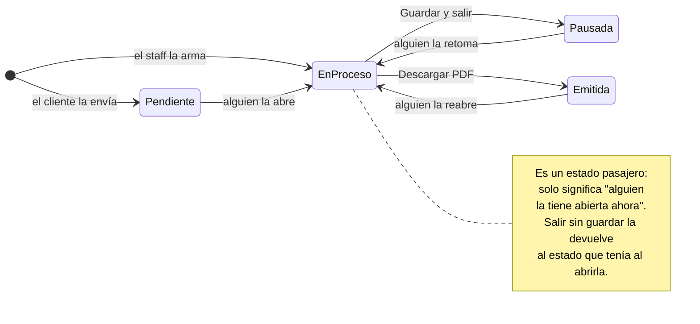
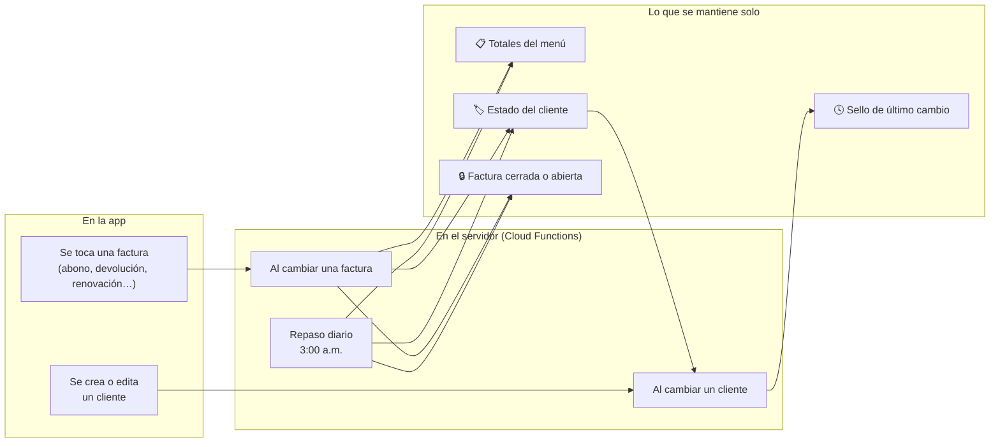

<div align="center">


# Ferrequipos de la Costa

**Catálogo público y sistema de gestión para una empresa de alquiler de equipos de construcción en la costa caribe colombiana.**

Una sola aplicación web que le muestra el catálogo al cliente, recibe sus solicitudes en tiempo real y le da al equipo interno todo lo que necesita para cotizar, facturar, cobrar y hacerle seguimiento a la cartera.

<br>


</div>

---

## El problema que resuelve

Un negocio de alquiler no vende: **presta y recupera**. Cada equipo que sale tiene que volver, y cada día que no vuelve se cobra. Eso obliga a saber, en todo momento y sin buscar en papeles:

- Qué equipos están afuera y desde cuándo.
- A quién se le venció el plazo y hay que llamar hoy.
- Cuánta plata falta por cobrar.
- Qué se hizo la última vez que se llamó a ese cliente.

Esta aplicación sostiene ese ciclo completo: **el cliente pide → se cotiza → se factura → se despacha → se hace seguimiento → se cobra → se cierra.**

---

## Dos aplicaciones en una

| | **Tienda y Kiosco** | **Panel interno** |
|---|---|---|
| **Para quién** | Clientes, desde su celular o desde una pantalla en el local | El equipo de Ferrequipos |
| **Qué hace** | Explorar el catálogo, armar un carrito y enviar la solicitud | Cotizar, facturar, cobrar y seguir la cartera |
| **Cómo entra** | Sin cuenta, abierto a todos | Con usuario y contraseña, con permisos por rol |
| **Detalle** | El modo Kiosco fuerza tema oscuro y tiene protector de pantalla por inactividad | Aviso sonoro cuando entra una solicitud nueva, y quién está conectado |

Cuando un cliente envía su solicitud, esta **aparece sola en el buzón del personal**, sin recargar la página, y suena una campana.

### Del lado del cliente

Explora el catálogo, entra al detalle de un equipo y arma su pedido eligiendo **cuántos** y **por cuántos días**. Los equipos que vienen en distintas presentaciones —medidas, capacidades— tienen **variantes**: se eligen con un toque, y el nombre del grupo lo define quien carga el equipo ("Tamaño", "Capacidad", lo que corresponda).

Al enviar el pedido se abre WhatsApp con el mensaje ya escrito, y en paralelo la solicitud entra al buzón del personal.

> [!NOTE]
> La campana suena **solo** para los pedidos que llegan de clientes. Una cotización que arma el propio personal no la hace sonar, y es a propósito: ya la está atendiendo quien la escribe. Cuando una alarma suena para todo, se deja de mirar.
>
> Entre que la solicitud queda guardada y la campana suena pasan **618 ms** medidos. Lo que a veces se siente como demora es el **arranque en frío** del servidor —de segundo y medio a dos y medio cuando lleva rato sin usarse—, que ocurre antes de las dos cosas y no separa una de la otra.

**Y cuando nadie tiene la app abierta, el aviso llega igual.** La campana resuelve el caso de quien está trabajando; el resto del día el pedido esperaría a que alguien entrara a mirar. Cada persona activa los avisos una vez **por aparato** —el celular y el computador de la oficina van por separado, porque el aviso viaja al aparato, no a la cuenta— y desde ahí el servidor le escribe al teléfono como lo haría WhatsApp.

| Aviso | Cuándo | De dónde sale |
|---|---|---|
| **Solicitud nueva** | Un cliente manda su pedido | La misma función que toca la campana — así hereda la regla de que **lo que arma el personal no avisa** |
| **Equipo vencido** | Un equipo cumple su fecha, con el calendario | El repaso de las 3 de la mañana |

El segundo tiene una vuelta que vale la pena: para saber **qué es nuevo** no se guarda ninguna marca. Se pregunta si el equipo está vencido **hoy** y no lo estaba **ayer**. Como los cálculos reciben la fecha como parámetro, alcanza con evaluarlos dos veces — un dato menos que mantener al día.

> [!WARNING]
> **Avisar por factura dejaba mudo medio problema.** La primera versión preguntaba por la *factura*: entró en seguimiento hoy y ayer no. Suena equivalente, y no lo es — una factura figura vencida en cuanto **uno solo** de sus equipos lo está, así que la que ya estaba en seguimiento no volvía a "entrar" nunca más y los equipos siguientes vencían en silencio.
>
> Se vio en una factura de dos equipos: el inicial venció un sábado y el aviso llegó; el agregado venció el domingo y no llegó nada. Preguntar equipo por equipo detecta cada vencimiento por separado, y el mismo truco de las dos fechas sigue sirviendo sin guardar nada. La factura que entra en seguimiento **sin ningún equipo vencido** —devolvió todo y quedó debiendo— se sigue avisando igual.

**El aviso no dice quién pidió ni qué pidió.** Aparece en la pantalla de bloqueo, donde lo lee cualquiera que tenga el teléfono a la vista: dice que hay una solicitud nueva y que entre a la app. Los datos están adentro, a un toque.

**El botón de activarlos aparece una sola vez** y desaparece apenas se usa. Un interruptor permanente para algo que se hace una vez es un botón que estorba todos los días. Vuelve a aparecer cuando de verdad hace falta: en otro aparato, si otra persona inicia sesión en ese mismo equipo, o si se borran los datos del navegador.

Ese segundo caso es más traicionero de lo que parece. En un computador compartido, si lo activa alguien que **no atiende solicitudes** —quien administra el catálogo, por ejemplo—, el aparato queda anotado en su ficha; la siguiente persona no vería el botón, creería que está todo listo y **no recibiría un solo aviso**. Por eso el registro guarda también **de quién es**: cada persona activa el suyo, y los dos conviven.

> [!NOTE]
> Tres límites que conviene conocer antes de perseguir un fantasma:
>
> - En **iPhone** los avisos solo funcionan con la app **instalada en la pantalla de inicio** (iOS 16.4+); abierta en Safari, el navegador no los soporta.
> - **El sonido y el ícono pequeño los decide el sistema operativo.** No se puede usar la campana propia de la app —esa suena solo con la app abierta— ni pedir que el ícono chico que Android dibuja junto al nombre del sitio vaya a color: lo toma **como silueta** y lo pinta con el color de acento del teléfono. Elegir bien esa imagen sí importa: de los cuatro íconos del proyecto, tres tienen el fondo pintado y su silueta es **un cuadrado**; solo uno tiene el fondo realmente transparente, y es el que deja ver la forma del logo.
> - Los avisos se registran **por dirección**. Activarlos entrando por una y usar la app desde otra no sirve: para el navegador son sitios distintos.

**Ese mismo archivo hace dos trabajos, y ahí se escondía un error viejo.** El ícono transparente es a la vez la silueta del aviso y el que Android usa para **instalar la app** y dibujar su pantalla de arranque. El manifiesto lo declaraba como 512×512 y el archivo medía 319×272 — el logo tal como estaba guardado. Se rehízo sobre un lienzo cuadrado del tamaño correcto **conservando la transparencia**, que era la parte delicada: cambiarlo por la versión opaca que también existía habría arreglado la instalación y devuelto el cuadrado a las notificaciones. Los demás íconos, de paso, quedaron enlazados desde el HTML: estaban en la carpeta pública sin que nada los nombrara, funcionando solo por convención del navegador.

**Un cambio en el aviso puede desplegarse y no llegar nunca al teléfono.** Vale la pena contarlo, porque el síntoma engaña: se cambió el texto y el ícono a la vez, y en el celular apareció **el texto nuevo con el ícono viejo**. Esa diferencia es la pista — el texto lo arma el servidor y llega siempre; el ícono lo dibuja el ayudante que vive en el teléfono, y ese no se estaba renovando. Eran tres cosas encadenadas:

1. El hosting servía ese archivo **con una hora de caché** —la regla de "nunca desde caché" existía para el service worker de la PWA, pero no para este—, así que el navegador pedía la versión nueva y recibía la vieja.
2. Aunque la hubiera descargado, se habría quedado **esperando turno**: una versión nueva no reemplaza a la anterior mientras siga viva, y la anterior no muere nunca — cada aviso que llega la despierta.
3. Y nadie iba a buscarla: el navegador solo revisa si hay versión nueva cuando alguien vuelve a registrarla, o una vez al día.

Las tres corregidas. La lección se generaliza: **cuando algo se despliega y "no cambia", primero hay que preguntarse quién dibuja eso** — si el servidor o el navegador.

**Abrir WhatsApp tiene su truco.** El pedido primero abre el chat y recién después termina de guardarse, no al revés: si se espera al servidor —uno o dos segundos—, el celular ya no reconoce la apertura como algo que el usuario pidió, la trata como ventana emergente y la manda a una pestaña nueva del navegador… que es justo donde `wa.me` se rinde y muestra **WhatsApp Web** en vez de la app. Por eso se llama a la **aplicación instalada** (`whatsapp://`), que además no abandona la página: la pestaña sigue viva guardando mientras el cliente escribe. Si no hay WhatsApp instalado, a segundo y medio cae al enlace web de siempre.

La misma regla vale del otro lado del mostrador: cuando el personal descarga el PDF de una cotización y se lo manda al cliente, el chat se abre igual —en la app del celular, o en WhatsApp Desktop si se trabaja desde el computador—. Las dos pantallas usan la misma pieza, así que no pueden separarse.

> [!NOTE]
> Saber si la app abrió tiene su vuelta: en el celular la pestaña queda **tapada**, pero en el computador **no** —WhatsApp Desktop se abre encima y la página sigue visible para el sistema—. Preguntando solo por eso, en el computador se abrían las dos cosas: la app *y* la web. La señal que sirve en ambos es el **foco**: cuando WhatsApp toma el control, esta ventana lo pierde.

Los **seis** lugares desde donde la app escribe por WhatsApp —el botón flotante, "Cotiza con nosotros", el panel lateral, el carrito, la cotización y el recordatorio de cartera— salen de la misma pieza, con el número de la empresa escrito una sola vez. Repartido en seis archivos, era cuestión de tiempo que un cambio llegara a cinco.

---

## Módulos del panel

| Módulo | Para qué sirve |
|---|---|
| **Solicitudes** | Buzón en vivo de lo que piden los clientes desde la tienda |
| **Cotización** | Arma la cotización, calcula totales y genera el PDF |
| **Cuenta de cobro** | Emite el documento de cobro con numeración propia (`CC-…`), y guarda el historial |
| **Clientes** | Ficha de cada cliente: sus facturas, su estado de cuenta y sus documentos |
| **Cartera / Seguimiento** | Los clientes que deben o se les venció el plazo, con su bitácora de gestiones |
| **Equipos** | Alta, edición y eliminación del catálogo, con fotos y variantes |
| **Usuarios** | Cuentas del personal, con roles y permisos |

El menú de entrada muestra además **cuatro números en vivo**: equipos afuera, plata por cobrar, cotizaciones del mes y cuentas de cobro del mes. Cada uno se filtra por permiso: quien solo administra el catálogo no ve las cifras de cartera.

### Roles

| Rol | Alcance |
|---|---|
| `gestorEditor` | Solo el catálogo de equipos |
| `gestorFacturacion` | Cotizaciones, cuentas de cobro, clientes y cartera |
| `gestorIntegral` | Todo lo anterior junto |
| `administrador` | Todo, más la gestión de usuarios |

---

## Cómo funciona por dentro

Esta es la parte que le da valor al proyecto: **casi ningún estado se elige a mano desde un menú.** Los estados se deducen de los datos o los mantiene el servidor. Un dato que alguien tiene que acordarse de actualizar es un dato que tarde o temprano miente.

### 1. La cotización

Nace de dos formas: la envía un cliente desde la tienda (queda **Pendiente**) o la arma el personal desde el menú.



| Venía de | ¿Hubo cambios? | Al salir | Queda |
|---|---|---|---|
| Cualquiera | Cualquiera | Descargar PDF | **Emitida** |
| Pendiente / Pausada / Emitida | No | Sale directo | Igual que antes |
| Pendiente | Sí | Descartar / Guardar | Pendiente / **Pausada** |
| Pausada | Sí | Descartar / Guardar | Pausada / **Pausada** |
| Emitida | Sí | Descartar / Guardar | Emitida / **Pausada** |
| Nueva | No | Sale directo | No se guarda nada |

> [!NOTE]
> **Por qué importa el estado pasajero:** sin él, una cotización que alguien abrió y dejó a medias quedaba marcada como "la tiene fulano" para siempre, y nadie más se atrevía a tocarla. Ahora ninguna salida la deja colgada.

**Regla de las 3 p.m.** — Al armar una factura, el alquiler arranca el mismo día si se carga antes de las 3:00 p.m. (hora de Colombia); desde esa hora, arranca al día siguiente. La app propone la fecha correcta sola.

### 2. La cuenta de cobro

Usa **exactamente los mismos estados** que la cotización: se abre, se pausa y se emite igual. Se numera sola (`CC-…`) y cobra el **saldo pendiente** de la factura, no el total.

Al emitirse queda **sellada**: una marca que dice que ese documento ya salió. El menú la usa para contar cuántas se emitieron en el mes con **una sola consulta**, en vez de traerse las cuentas del mes y contarlas una por una.

Ese sello es también lo que hace posible el botón de **pagada** —solo para administradores y solo sobre cuentas ya emitidas, con quien la marcó y cuándo—. Es un interruptor: si se marcó por error, se vuelve atrás. Y como el conteo del mes mira el sello y no el estado, cobrar una cuenta **no le mueve el número**: el menú sigue diciendo cuánto se facturó, que es lo que se le preguntó, y no cuánto falta cobrar.

### 3. La factura: su estado se calcula, nunca se guarda

Este es el corazón del sistema. El estado de una factura **no existe como campo** en la base de datos: se deduce cada vez que se mira, a partir de sus fechas, sus cantidades devueltas y su saldo.


| Estado | Qué significa |
|---|---|
| 🕓 **Pendiente** | Ya se facturó, pero todavía no llega la fecha de despacho |
| 🚜 **Activa** | Los equipos están afuera y el alquiler está vigente |
| ⚠️ **Vencida** | Se pasó la fecha y hay equipos sin devolver |
| 💰 **Cobro** | Volvieron todos los equipos, pero queda plata sin resolver |
| ✅ **Finalizada** | No queda nada pendiente, en ninguna de las dos direcciones |

> [!NOTE]
> **"Cobro" no siempre significa que el cliente deba.** También entra ahí cuando **la empresa le debe al cliente**: un depósito por devolver o un pago de más. Una factura solo llega a *Finalizada* cuando no queda ningún asunto de plata abierto — si no, una factura "terminada" podría estar tapando una deuda con el cliente.

> [!IMPORTANT]
> **La regla menos obvia — qué saldo cuenta en cada decisión.**
> Para saber si una factura pasa a *Cobro* o *Finalizada* se usa el saldo completo: es la cuenta final, no queda nada por cobrar después.
> Para saber si una renovación la devuelve a *Activa* se usa el saldo **anterior a esa renovación**. Los días recién agregados no cuentan todavía: se cobran cuando el cliente devuelva, igual que cualquier día de alquiler en curso. Si contaran, renovar nunca alcanzaría por sí solo para poner una factura al día.

**Ejemplo real:** una rana alquilada 4 días y pagada completa se vence → el cliente pide 3 días más → como no debía nada, vuelve a *Activa* → y vuelve sola a *Vencida* el día que se cumplen esos 3 días. Nadie tocó un menú.

### El equipo que no vuelve se sigue cobrando

Un equipo que pasó su fecha y sigue en la obra **suma un día de alquiler por cada día que pasa**, automáticamente. Da lo mismo si el cliente avisó que la entrega quedaba indefinida o si simplemente no devolvió y no contesta: en los dos casos tiene el equipo, y en los dos se cobra.

Esos días se cuentan **hasta el día de la devolución**. Cuando el equipo vuelve, quedan congelados en la cuenta: ni siguen creciendo, ni desaparecen.

En la ficha del cliente se ven en dos etiquetas separadas, porque son cosas distintas: los **días pactados** al ampliar el plazo, y los **días vencidos** que el cliente se tomó sin avisar.

> [!WARNING]
> **Este fue un error costoso.** Antes solo se cobraban los días de los equipos marcados como "entrega indefinida". Al que simplemente no devolvía no se le cobraba ni un día: la pantalla de cartera mostraba *"6 días · $1.200.000"* como aviso, pero esa plata no entraba en ninguna cuenta. Y a los indefinidos se les cobraba… hasta que devolvían, porque los días se calculaban al vuelo desde esa marca y al registrar la devolución se borraban de la cuenta. Dos clientes en la misma situación real se cobraban distinto según cómo se hubiera cargado una fecha.

### Y el que devuelve antes no paga lo que no usó

La misma regla, mirada desde el otro lado. Si el cliente alquiló cinco días y devolvió a los tres, **los dos días que no usó no son de la empresa**:

- **Si ya había pagado ese equipo** → se le restan esos dos días *y su IVA*, y esa plata le queda a favor.
- **Si todavía no lo pagaba** → los días simplemente se descuentan de la factura.

El crédito nunca pasa de lo que ese equipo tenía cobrado: una devolución anticipada baja la cuenta, no la da vuelta. En la ficha del cliente el número aparece en verde, y tanto en la cuenta de cobro como en el PDF va como un renglón aparte —*"−2 días sin usar"*— para que la fila siga cuadrando con los días por el valor del día.

> [!NOTE]
> Acá se escondía un error fácil de pasar por alto. El cálculo avisaba que había ajuste preguntando si el total era **mayor que cero**… y un crédito da un total **negativo**. Las ocho pantallas que consultan ese dato lo descartaban y seguían cobrando los días de más. La pregunta correcta no era *"¿es positivo?"* sino *"¿es distinto de cero?"*.

### 4. Las gestiones: la bitácora del cobro

El estado dice en qué punto está la factura. **La gestión dice qué se hizo para destrabarla.** Solo se ve en Seguimiento, y solo entran ahí las facturas *Vencidas* y en *Cobro*.

| Gestión | Qué pasó |
|---|---|
| ⚪ **Sin gestionar** | Acaba de entrar a la lista, nadie la ha trabajado |
| 📵 **Sin respuesta** | Se llamó al cliente y no contestó |
| 🔄 **Renovación** | Se le autorizaron más días |
| 📦 **Parcial** | Devolvió una parte de los equipos |
| 💰 **Cobro** | Devolvió todo, pero quedó debiendo |

Se guarda **el historial completo**, no solo lo último: así se puede reconstruir cuántas veces se llamó y cuándo (*"sin respuesta ×3"* antes de lograr contacto).

> [!NOTE]
> En el registro de llamadas, el número, la fecha y la hora **se sellan solos** y no se pueden editar. Si fueran editables, cualquiera podría anotar llamadas que nunca ocurrieron y la bitácora dejaría de servir como evidencia real de gestión.

### Qué se puede hacer desde cartera

Cada factura de la lista trae las acciones del cobro a la mano:

| Acción | Qué resuelve |
|---|---|
| **Llamar** | Marca el teléfono y deja la llamada anotada, con su resultado |
| **WhatsApp** | Abre el chat con un mensaje distinto **según la gestión** de esa factura: no se le escribe igual a quien nunca contestó que a quien ya devolvió y solo debe plata |
| **Renovar** | Le da más días al alquiler, con la opción de descuento, y recalcula lo que pasa a valer |
| **Registrar devolución** | Anota qué equipos volvieron —todos o una parte— y resuelve el depósito |

Los mensajes de WhatsApp se arman siempre sobre **la factura abierta**, no sobre todas las del cliente: con varias facturas, los números no se podrían atribuir a ninguna.

### Los cinco recordatorios de WhatsApp

**Ninguno se envía solo.** El mensaje sale cuando alguien toca el botón; lo automático es **cuál** de los cinco sale, y eso lo decide la gestión vigente de esa factura.

| # | Sale cuando | Cómo empieza |
|---|---|---|
| 1 | **Sin gestionar** — nadie la ha trabajado | *"Te recordamos que hoy… finaliza el período de alquiler…"* |
| 2 | **Sin respuesta** — se llamó y no contestó | *"Hemos intentado comunicarnos contigo por teléfono sin lograrlo…"* |
| 3 | **Renovación** — se le dieron más días | *"…a la que le extendimos el período de alquiler."* |
| 4 | **Parcial** — devolvió una parte | *"Recibimos la devolución de parte de los equipos… ¡Gracias!"* |
| 5 | **Cobro** — devolvió todo y debe plata | *"…tiene un saldo pendiente de $X."* |

Los cuatro primeros dicen cuántos equipos **vencidos** le faltan y cuánto debe. El quinto no menciona equipos: ya no le queda ninguno.

Así se leen, con un caso de una factura vencida por un solo equipo:

<details>
<summary><b>1 · Sin gestionar</b> — el primer aviso, el día que vence</summary>

```
👋 Hola, Aida Maria Maury.

Te recordamos que hoy, 28/08/2026, finaliza el período de alquiler de tu factura N° 1234.

Actualmente tienes 1 equipo pendiente de devolución y un saldo aproximado de $ 370.540.

Si deseas extender el alquiler o coordinar la devolución, por favor comunícate con nosotros.

Gracias por confiar en Ferrequipos de la Costa.
```
</details>

<details>
<summary><b>2 · Sin respuesta</b> — se le llamó y no contestó</summary>

```
👋 Hola, Aida Maria Maury.

Hemos intentado comunicarnos contigo por teléfono sin lograrlo, por eso te escribimos por este medio.

Tu factura N° 1234 tiene el período de alquiler vencido, con 1 equipo pendiente de devolución y un saldo aproximado de $ 370.540.

Para extender el alquiler o coordinar la devolución, por favor comunícate con nosotros.

Gracias por confiar en Ferrequipos de la Costa.
```
</details>

<details>
<summary><b>3 · Renovación</b> — se le dieron más días</summary>

```
👋 Hola, Aida Maria Maury.

Te escribimos por tu factura N° 1234, a la que le extendimos el período de alquiler.

El plazo que acordamos vence el 30/08/2026.

A la fecha tienes 1 equipo pendiente de devolución y un saldo aproximado de $ 370.540.

Si necesitas más tiempo o quieres coordinar la devolución, por favor comunícate con nosotros.

Gracias por confiar en Ferrequipos de la Costa.
```

El renglón del plazo tiene tres formas: **"vence el 30/08/2026"** si la fecha no llegó, **"venció el 20/08/2026"** si ya pasó, y **"Habíamos acordado extender el alquiler hasta que nos avises."** si quedó como entrega indefinida.
</details>

<details>
<summary><b>4 · Parcial</b> — devolvió una parte</summary>

```
👋 Hola, Aida Maria Maury.

Recibimos la devolución de parte de los equipos de tu factura N° 1234. ¡Gracias!

Todavía tienes 1 equipo pendiente de devolución y un saldo aproximado de $ 370.540.

Cuando puedas coordinar la entrega del resto, por favor comunícate con nosotros.

Gracias por confiar en Ferrequipos de la Costa.
```

Dice *"Todavía tienes"* y no *"Todavía quedan"*: con un solo equipo —el caso más común al final de una parcial— *"quedan 1 equipo"* no concuerda.
</details>

<details>
<summary><b>5 · Cobro</b> — devolvió todo y solo debe plata</summary>

```
👋 Hola, Aida Maria Maury.

Te recordamos que tu factura N° 1234 tiene un saldo pendiente de $ 370.540.

Ya recibimos todos los equipos, así que solo queda pendiente el pago.

Si ya lo realizaste o quieres coordinarlo, por favor comunícate con nosotros.

Gracias por confiar en Ferrequipos de la Costa.
```
</details>

El saldo va como **aproximado** en los cuatro primeros a propósito: los equipos que siguen afuera acumulan días, así que ese número cambia mañana. En el quinto no: ya no hay nada corriendo y la cifra es firme.

**Cómo se recorren, con un caso real.** Don Pedro tiene la factura 1234, que vence hoy:

```
Lunes 9:00   La factura vence hoy, nadie la trabajó  →  se le manda el 1
Lunes 15:00  No respondió; se le insiste             →  sale el 1 otra vez
Martes 8:00  Se le vuelve a escribir                 →  sigue saliendo el 1
Martes 10:00 Se lo llama y NO contesta               →  a partir de acá, el 2
Martes 16:00 Se lo llama y SÍ contesta               →  sigue el 2
Miércoles    Se le autorizan 5 días más              →  a partir de acá, el 3
Viernes      Devuelve 4 de los 10 equipos            →  a partir de acá, el 4
La otra sem. Devuelve el resto, pero queda debiendo  →  a partir de acá, el 5
```

Dos cosas que se leen mal si no se explican:

- **El primer mensaje se puede mandar las veces que haga falta.** No hay contador ni límite: mientras nadie registre una llamada sin respuesta, el mensaje sigue siendo el 1.
- **Una llamada atendida no cambia el mensaje.** Lo que importa no es que el cliente haya contestado, sino **qué se acordó** en esa llamada —una prórroga, una devolución—, y eso se anota aparte y sí lo cambia. Por lo mismo, una vez que quedó en *Sin respuesta*, volver a llamar y que conteste no lo devuelve al 1: se queda ahí hasta que se registre una renovación o una devolución.

Cuando la devolución es **parcial**, la línea del equipo se parte en dos: una queda cerrada con lo que volvió, y otra sigue con lo que el cliente conserva, con su propia fecha. Así cada parte lleva su historia y su cuenta por separado.

> [!WARNING]
> **Partir la línea en dos costó plata.** Las dos mitades se armaban copiando la línea entera, y con ella se copiaban cargos que son **del lote, no del renglón**: el pago, el tipo de pago, el transporte y el depósito. Como las cuentas los suman recorriendo todos los equipos, cada uno pasaba a contarse dos veces. Una factura real quedó con $1.397.000 pagados en vez de $1.198.500, y la pantalla ofrecía **devolverle** $54.060 a un cliente que todavía debía $144.440. El transporte se duplicaba igual, y por eso los renglones no sumaban el total. Esos cargos ahora quedan solo en la línea que volvió.

### Devolver no significa lo mismo desde los dos lados

La devolución se registra desde la ficha del cliente o desde cartera, y la diferencia no es de permisos: es qué significa esa devolución.

| Desde dónde | Qué equipos deja devolver | Qué queda anotado |
|---|---|---|
| **Ficha del cliente** | Solo los que **no han vencido** | La devolución, en el equipo. Nada en la bitácora |
| **Cartera / Seguimiento** | Solo los **vencidos** | La devolución **y** la gestión de cobranza |

Devolver un equipo que todavía está en plazo no es cobranza: nadie hizo nada para destrabar un vencimiento que no ha pasado. Si contara como gestión, la factura entraría a cartera el día que se venza **ya rotulada como trabajada**, cuando nadie la ha trabajado todavía.

> [!NOTE]
> Una factura figura vencida en cuanto **uno** de sus equipos lo está, y puede tener otros agregados después con su propia fecha. Por eso el botón de la ficha no se apaga cuando la factura vence, sino cuando ya no queda **ningún** equipo en plazo: lo que sigue en fecha se devuelve ahí, y lo vencido, en cartera.
>
> Por lo mismo, desde la ficha no se pregunta qué hacer con lo que el cliente se queda —darle más días, dejarlo indefinido—. Pactar un plazo se acuerda con alguien que ya está vencido: es cobranza, y se decide en cartera. Desde la ficha solo se registra lo que volvió, y lo que sigue afuera conserva su fecha.

### En cartera solo se ve lo vencido

Es la misma idea llevada a toda la pantalla. **Una factura entra a cartera con los equipos que quedaron vencidos, no con todo lo que tiene adentro.** Así que ahí no aparecen:

- Los equipos que **todavía están en fecha**, aunque la factura figure vencida por otro. Nadie tiene que devolverlos hoy.
- Los que el cliente **devolvió en plazo**, antes de que nada venciera. Esa devolución no se consiguió cobrando, y verla ahí obliga a preguntarse cuándo y por qué volvió ese equipo — una respuesta que esa pantalla no tiene, porque no pasó ahí.
- En los diálogos de **registrar devolución** y **ampliar vencimiento**, tampoco: solo ofrecen los vencidos. Un equipo ya devuelto no tiene vencimiento que correr, y darle días a uno que no ha vencido es una renovación que nadie pidió.

Todo eso se sigue viendo en la ficha del cliente, que es donde vive la historia completa de la factura.

> [!NOTE]
> **Una factura puede quedarse en cartera sin un solo equipo vencido**: le renovaron el que la trajo, o ya devolvió todo, y se queda por la plata. Ahí la tarjeta lo dice —*"Sin equipos vencidos: sigue en cartera por el saldo de $X"*— en vez de mostrar un hueco, porque lo único que queda por hacer es cobrar.
>
> **Cuánto se le reclama depende de si le quedan equipos afuera.** Si le quedan, se le cobra lo que debía **antes de la renovación**: los días recién concedidos todavía los está usando y se cobran cuando devuelva. Si ya devolvió todo, se le cobra la **cuenta completa**, con el costo de todas las ampliaciones, porque no queda nada corriendo.

### 5. El estado del cliente

Un cliente no tiene estado propio: **hereda el más urgente de sus facturas.**

```
⚠️ Vencida  →  💰 Cobro  →  🕓 Pendiente  →  🚜 Activa  →  ✅ Finalizada
◄──────────────── más urgente          menos urgente ────────────────►
```

Si don Pedro tiene una factura vencida y dos activas, don Pedro está **Vencido**. Un cliente sin ninguna factura queda **Inactivo**.

Este estado sí se guarda en la base, por una razón concreta: la lista de clientes necesita filtrar y contar por estado sin tener que leer las facturas de todo el mundo. De mantenerlo al día se encarga el servidor.

### 6. Los abonos: un pago, varias facturas

Un cliente rara vez debe una sola factura. Cuando abona, esa plata **se reparte sola** entre las que tienen saldo, con un orden que no es el cronológico:

1. Primero **la que más debe**. Si dos deben lo mismo, la más antigua.
2. A cada una se le aplica lo que le falta para saldarse; lo que sobra pasa a la siguiente.
3. Si después de saldarlas a todas todavía sobra, ese remanente **queda a favor** en la última, en vez de perderse.

**Ejemplo.** Don Pedro debe $300.000 en una factura y $500.000 en otra, y entrega $600.000. Se salda primero la de $500.000, y los $100.000 restantes van contra la otra, que queda debiendo $200.000.

Las facturas ya saldadas ni se tocan: no tiene sentido repartirle plata a quien no debe nada.

**Un pago puede repartirse entre varios medios** —parte por Bancolombia, parte en efectivo— y cada uno queda registrado por separado. Los medios disponibles son Nequi, Nequi A, Bancolombia, Daviplata y efectivo; los dos Nequi son cuentas de personas distintas del negocio, y por eso van separados.

Cuando el pago es **total**, escribir el primer medio completa el segundo solo: los dos tienen que sumar una cifra conocida. En cualquier otro caso **no**, y esa es la regla, no un detalle de la pantalla: en un pago parcial el cliente entrega lo que puede, y con abono entrega de más. En los dos, el monto lo decide quien está cargando.

> [!WARNING]
> **Ese autocompletado inventaba plata.** El reparto se aplicaba también en los pagos parciales: al escribir el primer medio, el segundo se llenaba con lo que faltaba para el total de la factura, y quedaba guardado como pagado dinero que nadie entregó.
>
> La prueba que lo destapó casi lo deja pasar. Usaba un monto **mayor** que el total, y ahí el resto da cero: el campo se veía vacío igual, con el error puesto y sin el error. Al probar un reparto, el monto tiene que ser **menor** que el total, o la prueba no distingue nada.

Si el cliente entrega **de más**, ese sobrante no se guarda como pago —quedaría cobrado de más y la cuenta no cerraría— sino como un abono a su favor, que es lo que realmente es.

> [!NOTE]
> **Saldo a favor.** Si el cliente pagó de más, ese sobrante es plata suya. La factura no termina hasta que se le devuelva, y para eso existe el botón **Devolver**, que registra la salida con su fecha y su medio — el reverso exacto de un abono.

### 7. El depósito: una garantía, no un ingreso

En el alquiler de equipos, el cliente deja un depósito como garantía. Se le cobra junto con el alquiler, **pero no es plata de la empresa**: vuelve a su bolsillo cuando entrega los equipos en buen estado.

**Don Pedro** alquila una mezcladora en $400.000 con $100.000 de depósito. Paga $500.000 y se lleva el equipo.

**Cuando devuelve la mezcladora**, quien la recibe la tiene delante y es el único momento en que alguien puede decir en qué estado volvió. Así que ahí mismo, al registrar la devolución, se define el depósito:

- **Volvió bien** → se le devuelven los $100.000.
- **Volvió rayada** → se retienen $30.000 con el motivo escrito, y esos $30.000 **sí** pasan a ser ingreso.

Desde ese momento, lo devuelto **deja de contar en el total** de la factura: lo que la empresa cobró de verdad fue el alquiler más lo retenido. Y ahí pasa una de dos cosas:

| Si el cliente… | Entonces |
|---|---|
| **Todavía debía** $200.000 | El depósito se descuenta solo: paga **$100.000** y listo |
| **Ya había pagado todo** | Quedan $100.000 **a su favor**: hay que entregárselos |

En el primer caso, cuando el usuario abre el diálogo de abono **el número ya viene neteado**: no hay que marcar nada ni acordarse de descontar. En el segundo, la factura muestra un botón para registrar la entrega.

> [!IMPORTANT]
> Mientras el depósito no se resuelva, la factura **no puede llegar a Finalizada**. Esa es toda la protección: no hace falta que nadie se acuerde de revisar quién tiene depósitos sin devolver, porque esas facturas siguen apareciendo en cartera hasta que se resuelvan.

El depósito se salda **una sola vez y por el total** —contando el de la factura y el de cada equipo agregado después— cuando vuelve el último equipo. Nunca por partes en una devolución parcial.

### 8. Una factura viva: se le pueden sumar equipos

Un alquiler no se congela al facturarlo. Si el cliente pide dos andamios más el martes, **se agregan a la factura que ya existe** en vez de abrir otra.

Los equipos que se piden juntos forman un **lote**, con su propio transporte, depósito y pago. Y cada equipo lleva **su propia fecha de despacho**: se pidieron el mismo día, pero pueden salir en días distintos y cada uno corre sus días desde que salió.

Si al pagar ese lote el cliente entrega de más, el sobrante **se reparte solo** entre las facturas que tengan saldo, con la misma regla de los abonos.

### 9. Editar una factura no es corregir un dato

El formulario de editar no toca un campo suelto: vuelve a armar la factura entera —equipos, pago, total—. Mientras solo tiene lo que se cargó al alta eso es seguro. El problema es lo que pasa **después**: un abono, un equipo agregado, una ampliación de plazo, una devolución parcial, un depósito ya resuelto. Esa historia queda anotada apoyada en un dato puntual, y el formulario no tenía forma de saber que la factura ya no estaba sola.

Ahora sí la sabe, y de eso salen las reglas:

- Una **factura finalizada** no se edita: agregar equipo, registrar devolución y editar quedan apagados, cada uno con su motivo.
- Un equipo con ampliaciones o una devolución parcial ya registradas **no se puede quitar** de la lista del formulario —es la única forma que tiene de "editarlo", y quitarlo perdería esa historia sin dejar rastro. Los demás equipos de la misma factura se editan normal.
- El **depósito** se bloquea una vez que ya se resolvió (devuelto o retenido).
- Un aviso arriba del formulario lista qué tiene la factura encima, sin bloquear nada más: número, fecha, transporte, IVA y pago inicial se editan siempre.
- **Eliminar la factura completa** se apaga si ya tiene algo de lo anterior. Sin nada encima —una factura recién cargada, mal tipeada— borrar y volver a cargarla sigue siendo la salida más simple.

---

## Los documentos que genera

Cuatro documentos en PDF, todos armados en el navegador —sin servidor de por medio— con los datos que ya están en pantalla:

| Documento | Para qué |
|---|---|
| **Cotización** | Lo que se le manda al cliente antes de alquilar. Se descarga y abre WhatsApp en un solo paso |
| **Cuenta de cobro** | El documento formal del cobro, numerado (`CC-…`). Cobra el **saldo**, no el total, y los equipos van a precio de lista con el descuento aparte |
| **Factura** | El detalle de un alquiler: equipos, días, fechas, pagos y saldo |
| **Reporte de cliente** | Varias facturas elegidas a mano, en un solo documento. Va en tamaño carta —los otros son A4— porque lleva más columnas |

La cuenta de cobro se puede armar **desde las facturas del cliente**: se eligen con casillas cuáles entran y el documento se llena solo.

---

## Lo que hace el servidor solo

Guardar un dato que se calcula trae un problema conocido: **se queda viejo**. Una factura que venció anoche no la escribió nadie, así que nada avisa del cambio. Estas automatizaciones existen para resolver exactamente eso.



**Los totales del menú.** El menú principal muestra cuántos equipos están afuera y cuánta plata falta cobrar. Antes esos dos números se calculaban recorriendo todos los clientes y todas sus facturas en cada visita. Hoy los mantiene el servidor en un solo documento que el menú lee de una sola vez.

Lo interesante es *cómo* se mantienen: cuando se toca una factura, el servidor recibe **cómo estaba antes y cómo quedó después**, calcula la diferencia y la ajusta. No lee ni una factura, y funciona igual para cualquier movimiento —incluidos los que se inventen mañana— sin tener que enseñarle qué es un abono o qué es una devolución.

**El estado del cliente.** Se corrige en el mismo disparador. Acá sí hay que leer las facturas de ese cliente: el estado no es una suma, es *"la más urgente de todas sus facturas"*, así que si a un cliente vencido le pagan la factura vencida, hay que mirar las otras para saber en qué queda. Son las facturas de un cliente, no las de todos.

**El sello de la lista de clientes.** Un vigilante sobre los clientes anota la fecha del último cambio. No lee nada y escribe dos líneas, pero le permite a la lista saber si su copia sigue sirviendo mirando un solo dato. Vive en el servidor y no en la app justamente para enterarse también de lo que se edita a mano en la consola de Firebase.

**El repaso de las 3 de la mañana.** Cubre lo que ningún disparador puede ver: las facturas que vencen **solas**, por calendario, sin que nadie escriba nada. Rehace los totales desde cero y corrige los estados que cambiaron con el paso del día. Lee todas las facturas a propósito, incluso las cerradas: es el único proceso que garantiza que los números estén bien, y filtrar ahí arriesgaría un total equivocado en silencio.

> [!TIP]
> **La regla de fondo:** ninguna pantalla es responsable de mantener datos al día. Antes, el estado de un cliente solo se corregía si alguien abría la pantalla de seguimiento — y si nadie entraba en una semana, la lista mostraba datos viejos toda la semana. Ahora las pantallas solo muestran; el servidor mantiene.

---

## Guardar los hechos, calcular las conclusiones

Que casi nada se guarde tiene un costo: para saber qué facturas están vencidas hay que traerlas y mirarlas. Con 200 clientes y cinco facturas cada uno, abrir la pantalla de cartera costaba leer más de mil documentos. Cada vez.

La salida no fue volver a guardar el estado —eso es lo que envejecía—, sino separar dos cosas que parecían una:

| | ¿Cambia sola con el calendario? | Entonces |
|---|---|---|
| ¿Se pasó la fecha de devolución? | **Sí**, a medianoche | Se **calcula** |
| ¿Devolvió todo, quedó a mano? | **No.** Solo si alguien escribe | Se **guarda** |

De ahí sale **`cerrada`**: una factura cerrada es la que llegó a *Finalizada*, o sea que no le queda ningún asunto de plata abierto —ni saldo, ni saldo a favor, ni depósito sin devolver—. Como nada de eso depende del calendario, un dato guardado no puede envejecer, y el servidor lo mantiene exacto.

Guardarlo es lo que permite **preguntarle a la base** en vez de traer todo para averiguarlo:

- **Cartera** pide los clientes marcados como vencidos o en cobro —que son exactamente los que tienen alguna factura por cobrar, ni uno más— y de ellos solo las facturas abiertas.
- **La ficha del cliente** carga solo lo abierto. El historial llega con un botón, y el estado de cuenta de arriba muestra lo que el cliente tiene abierto **hoy**, no lo que compró en toda su vida.
- **La lista de clientes** guarda su propia copia en el equipo y solo consulta un **sello** con la fecha del último cambio: si nadie tocó un cliente desde la última visita, no vuelve a pedir nada.

Con 200 clientes, abrir esas pantallas a lo largo de un día pasa de unas 24.000 lecturas a menos de 2.000.

> [!IMPORTANT]
> El precio de esta técnica: una factura **sin** el campo no aparece en las consultas que piden "las abiertas". Por eso el campo nace con la factura, el servidor lo corrige en cada cambio, y el repaso de madrugada repara el que falte. Tres redes para el mismo dato, porque una factura invisible es peor que una lectura de más.

### El saldo es una conclusión, no un hecho

La misma regla explica por qué **el saldo no se guarda**. De una factura se guarda lo que pasó —por cuánto se emitió, cuánto entregó el cliente, qué abonos hizo— y el saldo se arma con esos datos cada vez que se muestra.

Guardarlo parecía inofensivo y no lo era. Cada día que un equipo sigue afuera la deuda sube, y de eso nadie avisa: nadie escribe nada en la base a medianoche. Pero además quedaba **mal escrito** desde el momento cero: se recalculaba como *emitido − pagado − abonos* sobre valores que **no** incluyen los días de más, así que en una factura con el alta paga daba cero, y el saldo no puede bajar de cero. Los abonos posteriores restaban contra ese cero y desaparecían sin dejar rastro.

Una factura real llegó a mostrar $476.000 de diferencia entre las dos pantallas: la ficha del cliente recalculaba y veía el abono; cartera leía el número guardado y no.

Dejar de escribirlo no alcanzaba: el número viejo seguía dentro de los documentos, y aunque ningún código lo leyera, cualquiera que abriera la base lo iba a encontrar y creer. Se borró de todas las facturas que lo tenían. **Un dato que miente y nadie usa no es inofensivo: es una trampa esperando.**

> [!WARNING]
> **La misma trampa, más chica, volvió a aparecer.** Para saber si una prórroga saca la factura de cartera se mira lo que el cliente debía *antes* de esa renovación, y ese número parte del **valor guardado** de la factura — que no lleva ni las ampliaciones ni los créditos, porque los dos se calculan al vuelo. Restaba pagos y abonos, pero no lo que el cliente había devuelto sin usar: le cobraba días que el equipo no estuvo afuera. En una factura real decía **$208.700** donde el cliente debe **$144.440**.
>
> No basta con partir del valor guardado y restar la plata que entró: hay que restar también lo que dejó de deberse.

### Lo que se cobra una vez no se lee una sola vez

El **depósito** y el **transporte** se cobran por despacho, y una factura puede tener varios: cada lote de equipos agregado después sale con su propio flete y su propio depósito.

Leer `valorTransporte` de la factura a secas devuelve el del **primer** despacho. La cuenta total sí los suma todos, así que la pantalla mostraba una cifra mientras el total usaba otra, y los renglones no cuadraban. Las dos se piden a una función que recorre los lotes.

Es el reverso del error de la devolución parcial: allá un cargo del lote se contaba **dos veces**, acá se contaba **una sola** habiendo varios. Los dos salen de confundir *lo que se cobra por despacho* con *lo que se cobra por factura*.

---

## Arquitectura

**React 18 + Vite 6** como base, **MUI 5** para la interfaz, **Redux Toolkit** para el estado, **React Router 7** para las rutas, e instalable como **PWA** con actualización automática. El backend es Firebase completo.

### Los tres almacenes, y por qué

| Almacén | Qué guarda | Por qué ese y no otro |
|---|---|---|
| **Firestore** | Clientes, facturas, equipos, cotizaciones, cuentas de cobro, usuarios | Documentos duraderos, con consultas y filtros |
| **Realtime Database** | El "timbre" de las solicitudes nuevas y quién está conectado | Cobra por bytes, no por lectura: ideal para un dato diminuto que se escucha todo el día |
| **Storage** | Las fotos de los equipos y los avatares | Archivos |

La presencia se queda en la base en tiempo real por una razón puntual: es la única que avisa cuando alguien **cierra la pestaña de golpe**. Sin eso, un usuario que se va sin desconectarse quedaría marcado como conectado para siempre.

**Una persona vive repartida en los cuatro servicios**: su cuenta de acceso, su ficha, su presencia y su foto. Por eso eliminarla no es borrar un documento, sino cuatro cosas en cuatro lugares — y lo hace el servidor, no el navegador.

Antes no era así, y el resultado fue una lección: la foto se intentaba borrar desde la app, pero las reglas dejan tocar un avatar **solo a su dueño**, así que al eliminar a otra persona **fallaba siempre… en silencio**, tapado por un manejo de error vacío. La cuenta desaparecía, la ficha también, y la foto quedaba tirada en el servidor sin que nadie se enterara. **Un borrado que falla callado es peor que uno que falla a gritos**: el segundo se arregla, el primero se acumula durante meses.

> [!NOTE]
> **El truco del timbre.** La campana del personal no escucha las cotizaciones —eso costaría lecturas a toda hora—, escucha **un único dato minúsculo** en la base en tiempo real. Y no es un interruptor de encendido/apagado, sino un valor que *cambia*: cada dispositivo anota cuál fue el último que le sonó. Con un interruptor, la primera persona que lo viera lo apagaría y a las demás no les sonaría nunca.

### Las cuentas viven en un solo lugar

Todos los cálculos de dinero y estados están en un único archivo, que se **copia automáticamente** a las Cloud Functions en cada despliegue. Si las dos copias se separaran, el menú y la ficha del cliente mostrarían números distintos — por eso hay una prueba que falla si la copia queda desactualizada.

Lo mismo vale para **lo que se dibuja**. La historia de fechas de un equipo —cuándo salió, hasta cuándo tenía plazo, cuántos días se le agregaron, cuántos lleva de más— la arma un solo componente que usan tanto cartera como la ficha del cliente.

No es prolijidad. Cuando cada pantalla armaba lo suyo, terminaron contando cosas distintas de la misma factura: para 10 equipos con 2 días de renovación y 7 días vencidos, una mostraba "+2 días · $400.000" y la otra "+9 días · $1.800.000", con los días vencidos repetidos al lado en ambas. Se leía como si se cobraran $3.200.000 cuando eran $1.800.000. Hay pruebas que fijan el texto de cada dato para que no vuelva a pasar.

### La historia se cuenta en tres tramos

Aun con los números bien, los datos salían en una fila plana de fichas del mismo peso. "Se venció el 5", "se le dieron 2 días" y "quedó para el 7" son tres partes de **una** frase, y estaban cortadas en tres etiquetas sueltas, mezcladas con el precio por día. Cada una decía la verdad y el conjunto no se entendía.

Ahora van agrupadas, separadas por un corte fino, y las flechas atan lo que es causa y efecto:

```
🚚 Salió 03/08 · 3 días · $20.000/día │ Vencía 05/08 → +2 días · $400.000 → Venció 07/08 │ 7 días vencidos · $1.400.000
```

Cada tramo responde una pregunta: **qué se llevó**, **qué se pactó**, **qué corre solo**. Una factura al día y sin renovaciones muestra un solo tramo — el agrupado aparece cuando hay historia que contar, no le agrega nada al caso simple.

### Los totales se pueden abrir

Un número sumado esconde de dónde salió. El IVA de los cargos adicionales es el de todos los equipos del despacho junto: si la factura arrancó con $20.000 y después se le sumó un equipo de $30.000, muestra $50.000 sin forma de reconstruir el reparto. Una flecha lo abre y lista lo que aporta cada equipo.

Aparece **solo cuando hay algo que repartir**: más de un equipo que aporte, o uno solo que se parta en varios renglones. Con un equipo y un renglón el detalle repetiría el total que ya está arriba, y una flecha que no abre nada es peor que no tenerla. Mismo criterio en el botón del historial: dice **"Ver 12 facturas finalizadas"** con el número por delante, y si no hay ninguna no se muestra — antes había que apretarlo para descubrir que la lista venía vacía.

Cuando un equipo tiene días agregados, ese detalle se parte en varios renglones —*"10 chazas"*, *"10 chazas · días ampliados"*, *"10 chazas · días vencidos"*—, porque el IVA de lo que se pactó al principio, el de lo que se autorizó después y el de los días que el cliente se tomó sin avisar no son el mismo hecho. **Días ampliados** cuenta que alguien los autorizó; **días vencidos**, que el cliente no devolvió. Durante un tiempo la pantalla los llamaba a todos ampliados, y así contaba una autorización que nunca existió.

Al lado, bajo el **Total adicionales**, va el historial de ese número: a cuánto llegaba después de cada movimiento. Es un acumulado —el despacho más el IVA hasta ahí—, no lo que aporta cada renglón suelto, y se lee al revés de como ocurrió: lo más reciente arriba, el alta abajo del todo.

El renglón más nuevo va **vacío** a propósito. Su total es el que está arriba, siempre a la vista; repetirlo abajo haría creer que después pasó algo más.

Lo que el cliente **devolvió sin usar no tiene renglón propio**: se le resta a la renta del equipo, que es lo que corrige. Un equipo que salió por 3 días y volvió a 1 se lee como un solo renglón de 1 día —lo que se le cobra— y no como 3 y −2, que obliga a restar de cabeza para saber lo que interesa. El crédito sigue a la vista en los chips del equipo, que son los que cuentan cuántos días fueron.

### La plata del equipo también tiene historia

La fila de un equipo mostraba dos cifras, una debajo de la otra, y la de abajo **contenía** a la de arriba: $600.000 de renta inicial y $2.400.000 de total. Puestos así no dicen dos cosas, dicen una sola dos veces, y obligan a restar de cabeza para saber lo que interesa.

Se corrigió dejando abajo **solo lo que se agregó** — pero ese número seguía sumando hechos distintos en uno. En un Benetín de $190.000 el día daba $1.330.000, y adentro había $380.000 de una ampliación que alguien autorizó y $950.000 de cinco días que el cliente se tomó sin avisar. Es la misma confusión que ya se había resuelto en el IVA de los cargos adicionales, todavía en pie acá.

Ahora cada hecho tiene su propia cifra, en el orden en que ocurrió:

```
2  BENETÍN                          $ 1.330.000   ← los 7 días que se despacharon
                                    $   380.000   ← los 2 días que se ampliaron
                                    $   950.000   ← los 5 días vencidos
```

Van **sin rótulo**: qué es cada una ya lo cuentan los tramos de abajo —*"+2 días"*, *"5 días vencidos"*—, y el color las ata a su chip: el acento para lo pactado, el rojo para lo que corre solo. Un equipo al día muestra una sola cifra, como siempre. Y uno **ya devuelto** sigue mostrando un solo número —lo que de verdad se le cobró por los días que lo usó—, porque su cuenta está cerrada y ahí el desglose ya no ayuda a decidir nada.

**Y la tarjeta no creció.** Contar más cosas suele costar alto, pero acá no hacía falta: las cifras vivían dentro de la fila del nombre, así que cada una nueva la estiraba hacia abajo mientras al lado de los chips de fechas sobraba lugar vacío. La tarjeta pasó a leerse en **dos columnas** —el equipo y su historia a la izquierda, la plata a la derecha— y ahora el alto lo manda la más alta de las dos. Las cifras que se sumaron caen en un espacio que ya estaba ahí.

### La pantalla angosta decide qué cede, no qué se rompe

La ficha del cliente tiene tres piezas: quién es, cuánto debe y qué se puede hacer con él. Cuando el ancho deja de alcanzar, la que baja a su propia fila es **la cuenta** — que ahí gana espacio y muestra las cuatro casillas en vez de dos—; los botones se quedan arriba, junto al nombre. En celular, donde el nombre y seis botones ya no conviven, los botones pasan abajo y se centran.

El corte es un punto estándar, no el ancho exacto en que el contenido deja de entrar: ese número no existe, depende del largo del nombre de cada cliente.

### Una pantalla no es un archivo

La ficha del cliente llegó a 2.692 líneas en un solo archivo, y casi la mitad era un bloque corrido que dibujaba **una** factura: el estado, el subtotal, los equipos del alta, los agregados después, los abonos y la cuenta, todo seguido. Para mover de lugar el IVA había que leer mil líneas hasta encontrar dónde se dibujaba.

Hoy son 468 líneas y siete piezas con un oficio cada una: la tarjeta del cliente, la de una factura, la fila de un equipo, el recuadro del pago con sus abonos, los cargos adicionales, el estado de cuenta y los recuadros que comparten todas.

Lo que **no** se repartió es la cuenta de la factura: se calcula una sola vez en la tarjeta y baja hecha a la pieza que la muestra. Si cada una la sacara por su lado volveríamos al problema de siempre —dos lugares diciendo números distintos de la misma factura.

### El formato viejo que se dejó de sostener

Las primeras facturas de la app vinieron de una migración de Excel, y durante meses el código sostuvo dos formatos a la vez: el nuevo —una lista de pagos, equipos como objetos— y el viejo migrado —equipos como texto suelto, el pago como `modoPago` más `montoPagado`, un número que la app iba **acumulando** cada vez que se agregaba un equipo pagado—.

Ese doble soporte escondía un bug: al agregar un equipo pagado a una factura vieja, la cuenta tomaba el `montoPagado` ya acumulado como si fuera solo el pago del alta, y le sumaba **otra vez** los pagos de los equipos agregados. El "Pagado" se veía inflado y el saldo, más bajo del real —así se detectó, en una factura real donde el pagado subía $428.400 solo con abrir y guardar el lápiz.

> [!WARNING]
> El dueño confirmó que ya no queda ninguna factura del formato viejo en producción. En vez de parchar la cuenta una vez más, se sacó todo el código que existía solo para sostenerlo. Con el formato viejo fuera, ese bug deja de poder existir: no porque se corrigió una cuenta, sino porque la causa ya no tiene dónde vivir.

### Seguridad

- **Reglas de Firestore** que limitan qué puede leer y escribir cada quien.
- **App Check con reCAPTCHA Enterprise** en la función que recibe cotizaciones: solo la app real puede crearlas, un bot que descubra la dirección queda afuera.
- Las cuentas del personal se crean y se eliminan desde el servidor, con permisos de administrador.

> [!WARNING]
> Los permisos por rol de la interfaz son **comodidad, no seguridad**: definen qué botones se ven. Lo que de verdad protege los datos son las reglas del servidor.

Y esa advertencia no es teórica: **había dos acciones que solo estaban protegidas por la pantalla.** Eliminar una cuenta de cobro y darla por pagada mostraban su botón únicamente al administrador, pero la regla del servidor dejaba escribir a cualquiera con permiso de cuentas — alcanzaba con saber hacerlo desde la consola del navegador. Ahora las dos están cerradas del lado del servidor.

Cerrarlas tuvo su detalle: abrir una cuenta ya pagada la pasa a *En proceso* y **al salir vuelve a pagada**, y ese regreso lo hace cualquiera. Si la regla mirara solo el estado final, bloquearía el trabajo normal. Mira, en cambio, si se toca la **marca de quién y cuándo pagó** —lo único que escribe ese botón—, y usa el estado anterior para distinguir el regreso de una decisión nueva.

Un usuario cualquiera solo puede tocar dos campos de su propia ficha: **su foto** y **la lista de aparatos donde quiere recibir avisos**. Nada más — sin ese límite, cualquiera podría escribirse el rol de administrador desde la consola del navegador.

---

## Puesta en marcha

```bash
git clone <este-repositorio>
cd "FERREQUIPOS DE LA COSTA/ferrequiposdelacosta"
npm install
npm run dev
```

> [!IMPORTANT]
> Falta un archivo para que arranque: `src/Components/Firebase/firebaseConfig.js`, que no está en el repositorio porque lleva las claves del proyecto. Exporta un objeto `firebaseConfig` con la configuración web de Firebase.

<details>
<summary><b>Todos los comandos</b></summary>

<br>

| Comando | Qué hace |
|---|---|
| `npm run dev` | Servidor de desarrollo, accesible desde celulares en la misma red |
| `npm run build` | Compila la versión de producción |
| `npm run preview` | Sirve la versión ya compilada |
| `npm run lint` | Revisa el estilo del código (un aviso ya hace fallar) |
| `npm test` | Pruebas en modo continuo |
| `npm run test:run` | Pruebas, una sola pasada |
| `npm run test:coverage` | Pruebas con informe de cobertura |
| `firebase deploy` | Despliega la web y las funciones |
| `firebase deploy --only hosting` | Solo la web |
| `firebase deploy --only functions` | Solo las funciones |

Dentro de `functions/`: `npm run serve` levanta el emulador y `npm run logs` muestra los registros de producción.

</details>

<details>
<summary><b>Estructura del proyecto</b></summary>

<br>

```
FERREQUIPOS DE LA COSTA/
└── ferrequiposdelacosta/
    ├── src/
    │   ├── Components/     Componentes por dominio
    │   │   ├── ClienteDetalle/     Ficha del cliente y TODAS las cuentas
    │   │   ├── SeguimientoClientes/ Cartera y bitácora de gestiones
    │   │   ├── CuentaDeCobro/      Emisión y listado de cuentas
    │   │   ├── AdminCotizaciones/  Buzón de solicitudes
    │   │   └── VistaPdf/           Generación de PDF
    │   ├── Views/          Una vista por pantalla del panel
    │   ├── Store/Slices/   Estado global (carrito, cliente, cotización…)
    │   ├── Theme/          Tema claro/oscuro y variantes de botón
    │   └── Utils/          Formato de moneda y reglas de estado
    ├── functions/          Cloud Functions (Node 22)
    └── scripts/            Copia las cuentas al servidor antes de desplegar
```

</details>

---

## Pruebas

**476 pruebas** con **Vitest** y **React Testing Library**, junto al archivo que prueban.

Cubren la lógica de dinero completa —estados de factura, saldos, renovaciones con y sin IVA, días vencidos y su corte en la devolución, días pagados y no usados en una devolución anticipada, reparto de abonos entre varias facturas, devolución y retención del depósito, la regla de las 3 p.m., cuándo una factura cuenta como cerrada—, los 11 slices de Redux, el mapa de permisos y los hooks. Las funciones de cálculo reciben la fecha como parámetro, así que las pruebas no dependen del reloj.

También fijan **el texto de lo que se muestra** en la historia de fechas de un equipo: qué dice cada dato, en qué orden aparecen y cuál va marcado como urgente. Un cálculo correcto mal contado en pantalla se cobra igual de caro que un cálculo equivocado.

Y ya no se quedan en la lógica: **las pantallas se prueban dibujándolas de verdad**, con una persona simulada que teclea y hace clic. Firebase va reemplazado por un doble, así que la prueba no toca la base pero sí revisa **a qué documento** se iba a escribir y **qué**. Ahí están las tres operaciones que mueven plata —ampliar el plazo, registrar una devolución, agregar equipos a una factura viva—, los dos formularios grandes, los carritos, el login y las pantallas del panel.

Algunos ejemplos de lo que queda fijado: que un abono se reparta como se mostró en pantalla y no pise los anteriores; que la devolución parcial **parta la línea del equipo en dos**, una cerrada y otra que sigue corriendo; que el pago de un lote de equipos viaje **solo en el primero** —contarlo dos veces hacía subir el pagado al doble—; que al eliminar un cliente se avise cuántas facturas se lleva por delante; y que cada rol vea únicamente lo suyo.

**Lo que deliberadamente no se prueba** también es una decisión: los PDF, las piezas que solo muestran una cuenta ya calculada, la tienda y las vistas que arman el layout. Una prueba de un componente que únicamente repite lo que le pasan no atrapa errores: los repite.

> [!TIP]
> Dos hallazgos del camino, anotados para no repetirlos. Una prueba **pasaba sin comprobar nada** —buscaba un botón por una etiqueta que no existía, no encontraba ninguno y daba por buena la afirmación—; desde entonces, cuando se afirma que algo está bloqueado se prueba **también** el caso en que debe estar habilitado. Y varias pruebas de formularios fallaban solo al correr todas juntas: no era un error, era que se pasaban del límite de tiempo.

El checklist completo está en [`TESTING.md`](ferrequiposdelacosta/TESTING.md).

---

<div align="center">

**Ferrequipos de la Costa** · Alquiler de equipos de construcción · Costa Caribe, Colombia

<sub>Proyecto privado. Este documento describe la aplicación con fines de portafolio.</sub>

</div>
